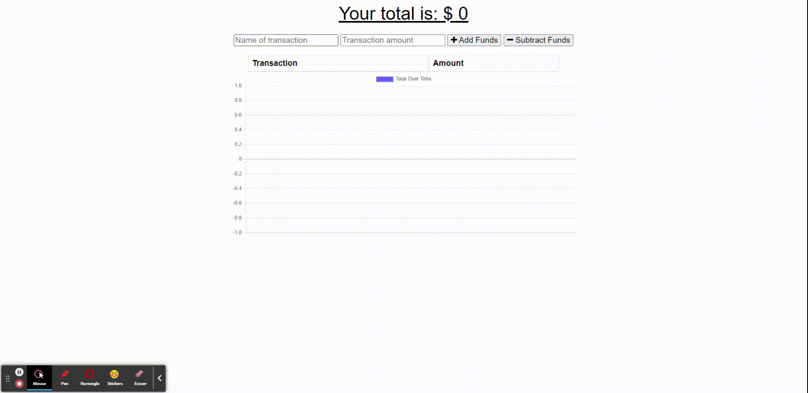

# Budget-Tracker-vl

## Description:

A No-SQL-Database application that allows the user to track their budget, online or offline.

## Table of Contents:

- [Installation](#installation)
- [Technology](#technology)
- [Questions](#questions)

Live link: https://polar-fortress-73675.herokuapp.com/

## Installation

If you wish to run this code locally:

- clone repo from GitHub on your local machine
- run `npm install` to add required dependecies
- run `npm start` to start the server

## Technology

- JavaScript
- Node.js
- Express.js
- MongoDb
- Mongoose
- Service Worker

## Questions

- GitHub: https://github.com/vitokwolf
- Email: victor.lupascu.1985@gmail.com
